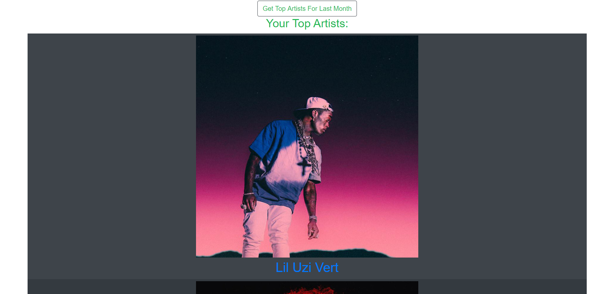
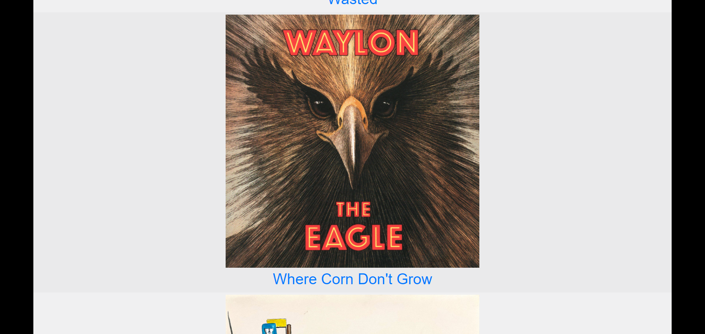
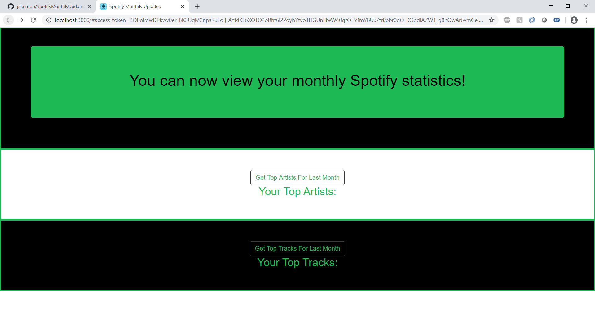

# SpotifyMonthlyUpdates
A web application that will inform you of your listening habits for the last month on Spotify

To start the app:

1. cd into src/authorization code and run npm install
2. cd into src/client and run npm install
3. cd into bin and run ./start-script.sh

This will pop up a browser that is displaying the app

Note: start-script.sh will leave the node jobs on your running on your computer even after you close the terminal. You must stop them manually.

SEE TOP ARTISTS

SEE TOP TRACKS

